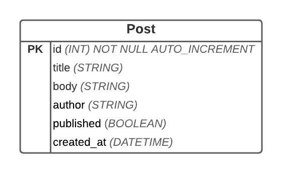

# PHP Console App

## Dependencies

1. Symfony console
2. Doctrine DBAL

## To run a command

``php application.php command_name``

see commands below

## Available commands:
-  ask    - Interactively asks name from the user
-  help   - Displays help for a command
-  list   - Lists commands
-  query-posts  - Display posts in a table format
-  edit-post    - edit post data from the database
-  published    - Fetch all post that are published only
-  write-post   - Insert new post data to the database
-  delete-post  - Delete post data from the database

##  Post Entity

## Author: 

Mike Bernal

## Kanban

https://github.com/mikebernal/consoleapp/projects/1

## Deadline:
Feb 22, 2021 9AM AWST TIME MONDAY
